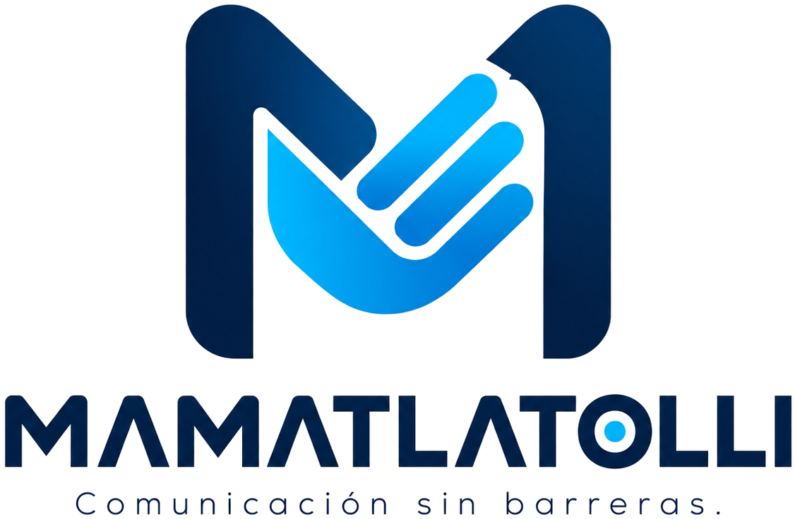

# Mamatlatolli

<p align="center">
  
</p>

**Mamatlatolli** reconoce Lengua de Señas Mexicana (LSM) con la cámara de la computadora. Capturas las señas de tu grupo y, cuando la mano se parece a una de esas plantillas, el texto aparece en pantalla.

No trae un banco de señas ni una red entrenada. Cada equipo guarda las suyas.

Proyecto estudiantil — Instituto Tecnológico de San Juan del Río.

## Empieza aquí

- **[Guía de usuario](docs/guia-usuario.md)** — instalar, capturar una letra, probar Abecedario y abrir el mini juego.
- **[Cómo funciona](docs/como-funciona.md)** — de la cámara al texto, con diagrama.
- **[Instalador de Windows](docs/empaquetado.md)** — bajar el Setup y saber dónde quedan las señas.

## Qué incluye

- Menú en español: **Abecedario**, **Vocabulario**, **Mini juego**, **Capturar plantillas**, **Biblioteca de señas**, **Configuración**, **Modo demostración** y **Acerca de Mamatlatolli**.
- Abecedario con las manos. Vocabulario suma cuerpo y rostro.
- Señas quietas y señas con movimiento.
- Mini juego de letras a contrarreloj, con récord en esa computadora.
- Exportar e importar la biblioteca en un archivo `.mamatlatolli`.
- Modo claro y modo oscuro.

## Instalación rápida

### Setup de Windows

Para un equipo del salón, usa **Mamatlatolli-Setup.exe**. Se baja del artifact **Mamatlatolli-Windows**, en el workflow **Instalador Windows de Mamatlatolli** de GitHub Actions. Crea accesos directos y se desinstala desde Configuración de Windows.

Pasos, SmartScreen y la carpeta `%LOCALAPPDATA%\Mamatlatolli`: [docs/empaquetado.md](docs/empaquetado.md). La demo, sin comandos: [docs/guia-usuario.md](docs/guia-usuario.md).

<a id="desde-el-codigo"></a>

### Desde el código

Python 3.10, 3.11 o 3.12, en Windows, macOS o Linux. Conviene un entorno virtual.

```bash
python -m venv .venv
```

Actívalo (`.venv\Scripts\Activate.ps1` en PowerShell, `source .venv/bin/activate` en macOS o Linux) e instala:

```bash
pip install --upgrade pip
pip install -r requirements.txt
python app.py
```

También funciona `python -m innova`. Sin cámara: `python app.py --demo`. Otra cámara: `python app.py --camara 1`. En Linux, si la ventana no abre, instala `python3-tk`.

Las señas de esta forma de correr quedan en `datos/`, dentro del repositorio, y no se suben al git. Pruebas: `python -m unittest discover -s tests -v`.

El mapa de carpetas está en [Cómo funciona — Estructura del código](docs/como-funciona.md#estructura-del-codigo).

## Hoja de ruta

Hecho en esta versión:

- Ventana, cámara y detección de manos.
- Plantillas quietas, comparación de formas y filtro para no aceptar un parpadeo.
- Menú, señas con movimiento y comparación del recorrido.
- Abecedario y Vocabulario separados.
- Cuerpo y rostro en Vocabulario.
- Exportar e importar la biblioteca, e instalador de Windows.

Lo que sigue es capturar palabras en **Capturar plantillas**, con consentimiento. No vienen de fábrica ni hay una lista que el programa recorra.

El detalle de fases está en [Menú, Abecedario y Vocabulario](docs/menu-y-senas-dinamicas.md#hoja-de-ruta).

## Documentación

| Documento | Qué es |
| --- | --- |
| [Guía de usuario](docs/guia-usuario.md) | Demo escolar: instalar, capturar, jugar, exportar. |
| [Cómo funciona](docs/como-funciona.md) | De la cámara al texto, con diagrama y mapa del código. |
| [Empaquetado](docs/empaquetado.md) | Setup, artifact, datos de usuario, construir en Windows. |
| [Menú y señas dinámicas](docs/menu-y-senas-dinamicas.md) | Tarjetas, DTW, automático frente al botón, mini juego. |
| [Esquema de datos](docs/esquema-datos.md) | JSON de cada seña y el paquete `.mamatlatolli`. |

## Licencia y privacidad

Código de un prototipo académico, para aprender. La cámara se usa en el momento; las plantillas se quedan en la computadora de quien las capturó. Pide consentimiento antes de grabar a una persona —en Vocabulario la captura puede incluir rostro y torso— y no repartas esas señas sin permiso.
