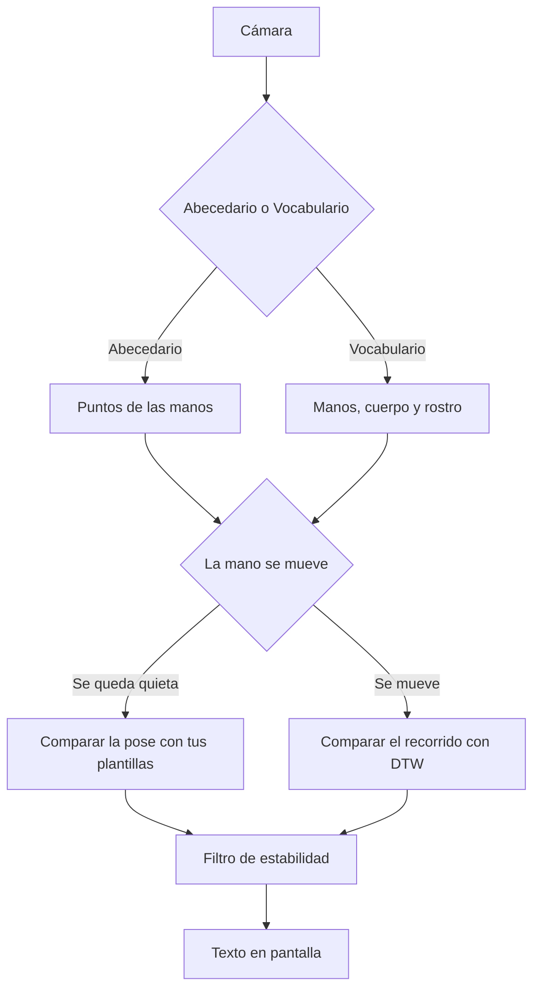

# Cómo funciona Mamatlatolli

Mamatlatolli mira la cámara, marca puntos de la mano y compara esa forma con **plantillas** que alguien capturó en este equipo. En Vocabulario también marca el cuerpo y el rostro. Cuando la comparación se sostiene, escribe la letra o la palabra en pantalla.

Cada salón tiene su propio banco. No hay un vocabulario descargado ni una red neuronal que se entrene al usar el programa.

## De la cámara al texto

1. **Cámara.** Cada imagen entra al programa. La vista en vivo va en espejo, para que acomodar la mano se sienta como una videollamada.
2. **Puntos.** [MediaPipe](https://developers.google.com/mediapipe) marca la mano: 21 puntos (muñeca, nudillos y puntas). En **Vocabulario** suma la pose del cuerpo (33 puntos) y una malla del rostro (478 puntos). En **Abecedario** solo corre la mano, para ir más ligero.
3. **Plantillas.** Esos puntos se comparan con las señas guardadas en **Capturar plantillas**, y solo con las de la categoría abierta: letras en Abecedario, palabras en Vocabulario.
4. **Quieta o con movimiento.** Si la muñeca casi no se desplaza, se compara una pose. Si se mueve con claridad durante una ventana corta (alrededor de 0,4 a 0,8 segundos), se compara el recorrido. El botón **Seña con movimiento**, o mantener **Espacio**, graba el recorrido aunque el detector no lo haya disparado solo.
5. **Filtro de estabilidad.** Una pose quieta no se acepta en la primera imagen parecida: tiene que repetirse con suficiente claridad. Una seña con movimiento se acepta **al terminar** el gesto, una sola vez, si la comparación alcanza. Así no se llena la pantalla con un renglón por imagen.
6. **Texto.** La seña confirmada aparece grande y pasa a la lista **Lo que ya leímos**. Si hay mano pero todavía no hay acuerdo, se ve **Buscando…**. Si no hay mano, se ve **—**. En el código, ese estado de espera se llama `detectando…`; la pantalla lo muestra como **Buscando…**.



Las plantillas salen de este equipo. Abecedario no usa la rama de cuerpo y rostro.

## Seña quieta

La mano se acomoda para poder compararla aunque la persona esté más cerca o más lejos: la muñeca queda en el origen y el tamaño de la palma queda cerca de 1. No se gira el dibujo, porque en LSM la orientación de la mano distingue letras.

Esa forma se vuelve una lista de números y se mide qué plantilla estática de la misma categoría queda más cerca. En palabras, si la cámara vio el cuerpo y la cara, esa distancia mezcla tres partes. La mano pesa más (0,55), luego la pose (0,30) y luego un recorte del rostro —ojos, cejas y boca— (0,15). Si falta el cuerpo o la cara en ese momento, o en la plantilla, esa parte se omite y el peso se reparte. Una palabra guardada solo con la mano sigue pudiendo compararse.

El filtro pide acuerdo en el tiempo: varias lecturas seguidas, o varias dentro de una ventana corta, por encima de un umbral de confianza. Si la seña ya se mostró, cuesta un poco más cambiarla, para que no parpadee. Esos umbrales se pueden subir o bajar en **Configuración**.

## Seña con movimiento

El programa guarda la trayectoria: varios fotogramas, cada uno con la forma de la mano y hacia dónde se fue la muñeca desde que empezó el gesto. En una palabra, cada fotograma puede traer también pose y rostro.

**DTW** (Dynamic Time Warping) alinea dos recorridos que no duran exactamente lo mismo y elige la plantilla dinámica más cercana de esa categoría. Una grabación útil necesita el gesto completo (al menos unos 6 fotogramas con mano). Al soltar, hay una sola comparación: no se escribe la seña en cada fotograma del movimiento.

## Abecedario y Vocabulario

| | Abecedario | Vocabulario |
| --- | --- | --- |
| Qué lee | Letras que capturaste | Palabras que capturaste |
| Qué mira | Solo las manos (hasta dos) | Mano, pose y rostro |
| Qué dibuja | Puntos y conexiones de la mano, y un recuadro | Lo mismo de la mano, más un esqueleto y puntos de la cara |
| Si falta pose o rostro | No los usa | Sigue con la mano |

Los dos modos comparten el mismo criterio de pose quieta frente a recorrido, y el mismo filtro. **Mini juego** es un caso aparte: solo letras estáticas, 5 segundos y puntos por rapidez. No usa DTW ni palabras. La partida está descrita en la [guía de usuario](guia-usuario.md#juega-una-ronda).

Si los modelos de pose o de rostro no llegan a cargar, Vocabulario no se detiene: reconoce con la mano y deja esos datos vacíos en la plantilla.

## Plantillas de quien usa el programa

Guardar una seña en **Capturar plantillas** escribe un ejemplo en la biblioteca de este equipo. Reconocer es medir parecido con esos ejemplos.

Eso es distinto de entrenar una red de aprendizaje profundo: aquí no hay una fase que ajuste miles de pesos con un corpus grande, ni un modelo de LSM que se descargue al instalar. El banco crece cuando alguien captura otra toma. Dos computadoras comparten señas solo si se exporta e importa un archivo `.mamatlatolli`.

El archivo es un paquete local. No hay cuenta ni sincronización. El formato está en [Esquema de datos](esquema-datos.md).

<a id="donde-quedan-las-senas"></a>

## Dónde quedan las señas

- Con el instalador de Windows: `%LOCALAPPDATA%\Mamatlatolli`.
- Al correr el código del repositorio: la carpeta `datos/` (`datos/plantillas/` y `datos/config.json`). Esos JSON no se suben al git.

[Empaquetar Mamatlatolli para Windows](empaquetado.md) explica las dos carpetas y qué pasa al desinstalar.

## Si quieres el detalle

- Menú, captura dinámica, automático frente al botón, mini juego y biblioteca: [Menú, Abecedario y Vocabulario](menu-y-senas-dinamicas.md).
- Campos JSON, pesos de la comparación y el paquete `.mamatlatolli`: [Esquema de datos](esquema-datos.md).
- Uso en el salón, sin comandos: [Guía de usuario](guia-usuario.md).

<a id="estructura-del-codigo"></a>

## Estructura del código

El programa se llama Mamatlatolli. La carpeta de Python del repositorio se llama `innova/`.

```
app.py                     Arranque (también lo usa el programa instalado)
empaquetado/               Instalador de Windows
.github/workflows/         Construcción del Setup en GitHub Actions
innova/
  cli.py                   Argumentos (--demo, --camara) y aviso si el programa instalado falla
  rutas.py                 datos/ en desarrollo; carpeta del usuario si está instalado
  textos.py                Frases en español que ve quien usa el programa
  tema.py                  Modo claro y oscuro, logo e icono
  menu.py                  Las ocho tarjetas y el texto de Acerca de
  pantallas.py             Menú, reconocimiento, mini juego, captura, biblioteca, ajustes
  ui.py                    Ventana y navegación
  practica.py              Mini juego: 5 segundos, puntos y récord
  audio.py                 Sonidos del mini juego
  camara.py                Cámara real o video de ejemplo
  detector.py              Manos
  cuerpo.py                Pose y rostro, para Vocabulario
  overlay.py               Dibujo de puntos sobre el video
  caracteristicas.py       Normalizar y comparar formas
  movimiento.py            Decidir si la mano se está moviendo
  dtw.py                   Comparar recorridos
  estabilidad.py           No aceptar la seña hasta que se sostenga
  reconocimiento.py        Unir pose quieta, DTW y el filtro
  pipeline.py              Un fotograma: detectar, reconocer, dibujar
  esquema.py               Formato JSON de cada seña
  plantillas.py            Leer y escribir la biblioteca
  paquete.py               Exportar e importar .mamatlatolli
  exportar.py              Lo mismo, desde la terminal
  importar.py              Lo mismo, desde la terminal
  __main__.py              Permite arrancar con python -m innova
  ajustes.py               config.json
  config.py                Umbrales y tamaños
datos/plantillas/          Señas locales cuando se corre desde el código
assets/                    Logo, icono y sonidos
```
